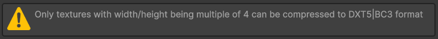
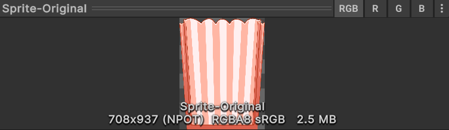
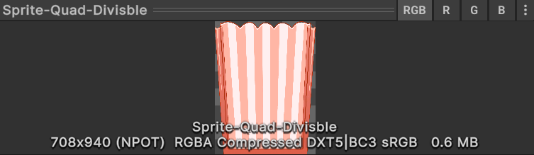
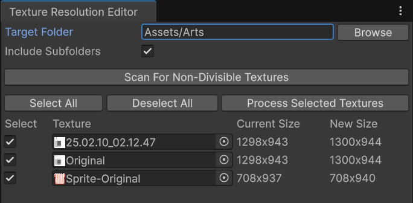

# Quad-Divisible Sprite Processor

[](https://openupm.com/packages/com.maoyeedy.quad-sprite-processor/)



## Why Quad-Divisible?

During school projects, artists often gave me sprites with dimensions like 543x981 or 1381x737. 

Those can't be compressed to DXTn/BCn formats, thus bloating our final build size.

However, By resizing their dimensions to multiples of four, we witness significant smaller size:

<div align="center">
  <table>
    <tr>
      <td align="center"><br><b>Original</b></td>
      <td align="center"><br><b>Quad-Divisible (Way Smaller)</b></td>
    </tr>
  </table>
</div>

## Features

- Resize textures to be quad-divisible with minimal quality loss
- Batch process multiple textures at once
- Allow considering imported size, instead of original size

## How to Install

Package Manager - *Install Package from Git URL*
```
https://github.com/Maoyeedy/QuadSpriteProcessor.git
```

Or use [OpenUPM CLI](https://openupm.com/packages/com.maoyeedy.quad-sprite-processor/)
```
openupm add com.maoyeedy.quad-sprite-processor
```

Note: Only supports Unity **2021.3** Onwards. (As it utilizes `Texture2D.Reinitialize`)

## How to Use

It's recommended to use it when making the final release builds, instead of whenever you import a new sprite.

### 1. Editor window
- *Tools/Quad Sprite Processor*
- Set path, Scan, Select, Process

   

### 2. Context Menu (less recommended)
- (Multi-Select and) right-click assets in project panel.
- *Resize to be Quad-Divisible*

# Development

## TODO
- [ ] Backup the original sprites? (Not high priority, as I myself'd just rely on VCS to rollback.)
- [ ] Better options with more validationa and callbacks
- [ ] Add tranparent pixel instead of resize for transparent PNG
- [ ] Option to "Round to nearest power of two" (For mipmap needs)
- [ ] Allow using it as AssetPostprocessor, with some matching rules. So that it auto-converts every sprite you import

## Why making this

As most of my projects are built for WebGL, I've always been trying to squeeze the build sizes for faster loading time. 

I once optimized a 2D game WebGL Build from 100MB to 40MB with a [custom Powershell script](https://gist.github.com/Maoyeedy/769ad8f2f4faf3f5c219b07658bc3880) to recursively process all textures. However, that requires CLI and ImageMagick, so I made it integrated into Unity Editor to be more user-friendly.

## Contribution

Any bug reports/feature requests are welcome! [Open an issue](https://github.com/Maoyeedy/QuadSpriteProcessor/issues/new) and I will look into it asap.

## Resize Test Results

- [ ] 254x254 - needs small adjustment
- [ ] 257x257 - slightly above max size
- [ ] 252x256 - one dimension already divisible
- [ ] 255x253 - different remainders
- [ ] 445x447 - similar to original problem
- [ ] 255x255 - at edge of max size
- [ ] 259x257 - just above max size
- [ ] 445x445 - square version of original

Command to generate test image:
```
magick -size {width}x{height} canvas:black test_{width}x{height}.png
```

